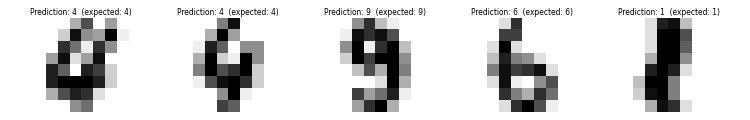
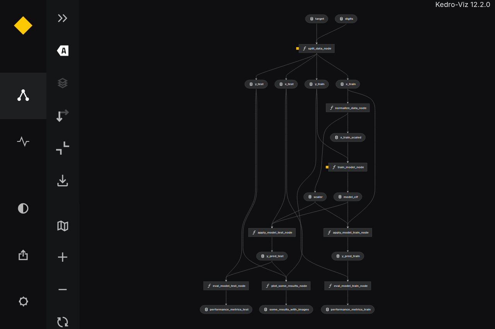
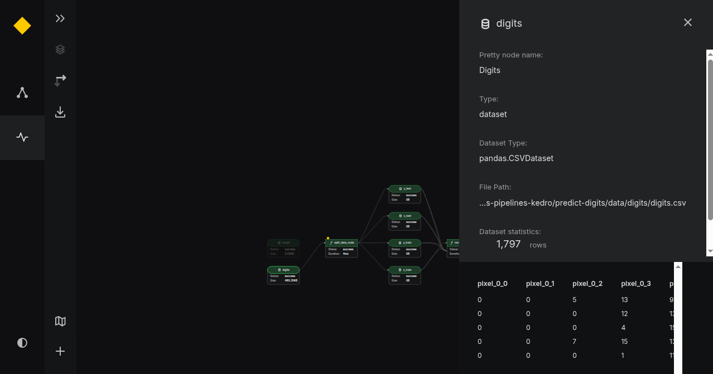
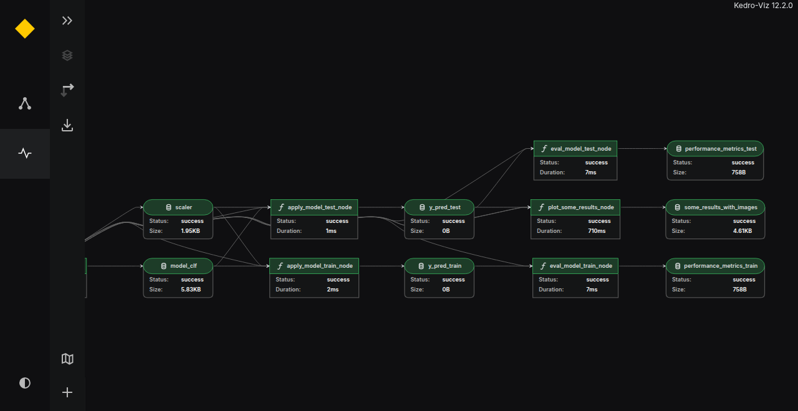
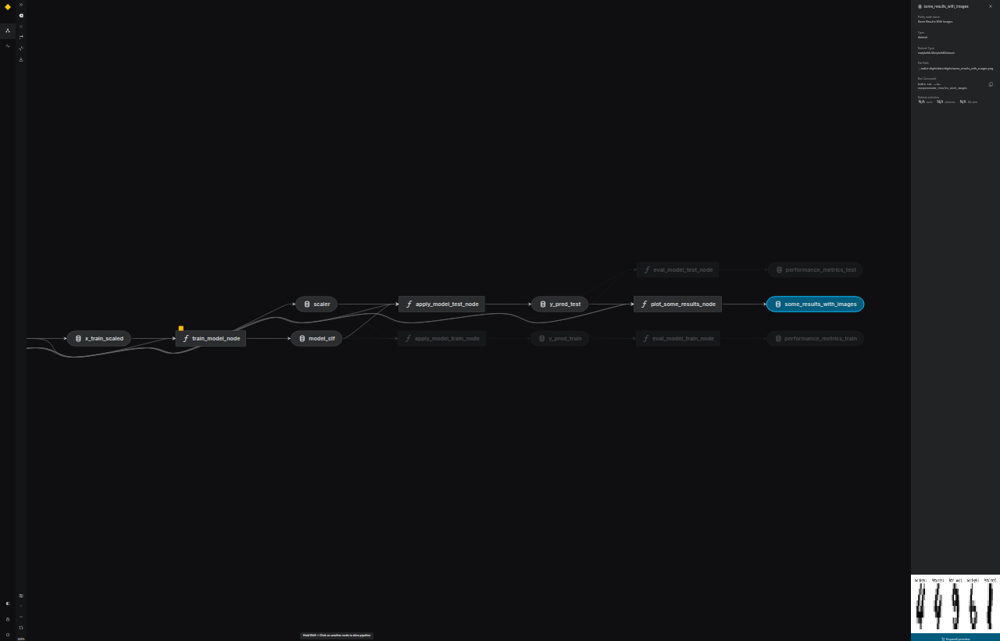
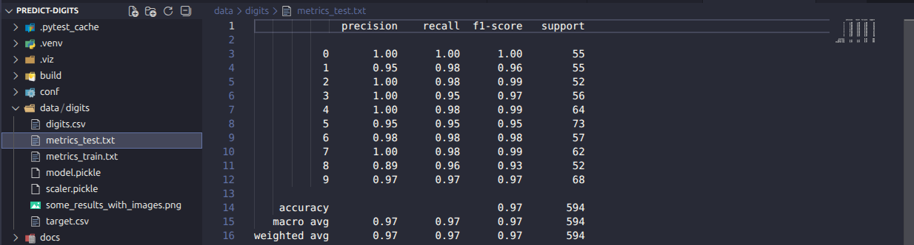

# Pipeline com Kedro para classificação dígitos


## Overview

Com base nos valores de pixels de imagens de dígitos manuscritos, desenvolvemos um pipeline em caráter de estudos para pré-processamento, modelagem, predição e avaliação de performance, para tarefa de classificar o dígito presente em uma imagem de entrada que contém um dígito manuscrito.



Em seguida, implementamos esses códigos na forma de um pipeline com o Kedro, no qual os nós correspondem as etapas feitas previamente no [Jupyter notebook](./notebooks/steps-kedro-pipeline-logistic-model-digits-handwritten-dataset.ipynb).

Em resumo, segundo o [Github do Kedro](https://github.com/kedro-org/kedro)
> Kedro é uma caixa de ferramentas para ciência de dados pronta para produção. Ele usa as melhores práticas de engenharia de software para ajudá-lo a criar pipelines de engenharia e ciência de dados que sejam reproduzíveis, fáceis de manter e modulares.


### Setup de ambiente local
```shell
python -m venv  .venv  # create a virtual enviroment named .venv
source .venv/bin/activate  # activate the .venv
python -m pip install -r requirements.txt  # instala pré-requisitos no ambiente virtual
```

## Como rodar os códigos

Para executar os códigos do pipeline no Kedro, rodamos o seguinte comando no terminal:

```shell
kedro run
```

### CLI Kedro
Com os comandos da CLI (_Command Line Interface_) do Kedro é possível explorarmos o pipeline criado de forma organizada. Abaixo, temos alguns de seus comandos:

```shell
Global commands from kedro
Commands:
  info     Get more information about kedro.
  new      Create a new kedro project.
  starter  Commands for working with project starters.

Global commands from Kedro-Viz
Commands:
  viz  Visualise a Kedro pipeline using Kedro viz.

Project specific commands from kedro
Commands:
  catalog   Commands for working with catalog.
  ipython   Open IPython with project specific variables loaded.
  jupyter   Open Jupyter Notebook / Lab with project specific variables...
  package   Package the Kedro project as a Python wheel and export the...
  pipeline  Commands for working with pipelines.
  registry  Commands for working with registered pipelines.
  run       Run the pipeline.
```

**OBS:** Para mais informações veja a [documentação da CLI do Kedro](https://docs.kedro.org/en/stable/getting-started/commands_reference/#kedros-command-line-interface).


## Kedro viz

Para visualizar o pipeline criado, podemos usar o seguinte comando:
```shell
kedro viz
```

É possível exportar (`--save-file`) e importar (`--load-file`) essa informações estruturadas dessa vizualização com:

```shell
kedro viz --save-file diagram/my_shareable_pipeline.json
```




## Listando os pipelines disponíveis

Podemos explorar os comandos da CLI do Kedro usando a flag `--help`. Por exemplo, ao rodaro seguinte comando

```shell
kedro registry --help

# resultado esperado:
# Usage: kedro registry [OPTIONS] COMMAND [ARGS]...

#   Commands for working with registered pipelines.

# Options:
#   -h, --help  Show this message and exit.

# Commands:
#   describe  Describe a registered pipeline by providing a pipeline name.
#   list      List all pipelines defined in your pipeline_registry.py file.
```




Dessa maneira, conseguimos exibir todos os pipelines e subpipelines registrados no `pipeline_registry.py` com:

```shell
kedro registry list

# - __default__
# - apply_model
# - eval_metrics
# - prepare_dataset
# - training_model
```




É possível obtermos mais informações sobre um determinado pipeline registrado usando o `describe`. Por exemplo, para ver mais quais nós implementamos para a etapa de avaliação de métrica rodamos o seguinte comando:


```shell
kedro registry describe eval_metrics

# Nodes:
# - eval_model_test_node (eval_model)
# - eval_model_train_node (eval_model)
# - plot_some_results_node (plot_some_results)
```



As métricas que avaliam o modelo treinado foram exportadas em para formatos que podem ser úteis para as análises de performance.




## Refs

- https://docs.kedro.org/en/stable/

- https://docs.kedro.org/en/stable/getting-started/commands_reference/#kedros-command-line-interface


- https://github.com/kedro-org/kedro

- https://kedro.org/

- https://www.youtube.com/@kedro-python/videos
